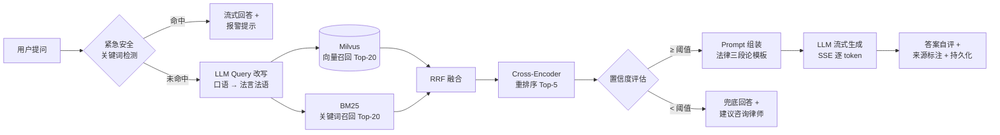

<div align="center">

# ⚖️ LexAtlas 法枢

**RAG-Powered Legal Intelligence Platform**

*让每一次法律咨询，都有法条可查、有案例可参、有逻辑可追。*


[快速开始](#-快速开始) · [架构设计](#-架构设计) · [API 文档](#-api-文档) · [参与贡献](CONTRIBUTING.md)

[中文] | [English](README_EN.md)

</div>

---

> ⚠️ **免责声明**：LexAtlas 仅用于法律知识科普与 RAG 技术学习，输出内容不构成法律意见，不能替代执业律师。所有回答均标注参考来源，并在置信度不足时主动提示咨询专业律师。

## 为什么是 LexAtlas？

直接向大模型提问法律问题，会得到**流畅但不可信**的答案——幻觉法条、编造案例、无从核验。LexAtlas 用检索增强生成（RAG）解决这个问题：

|      | 通用大模型直接回答 | LexAtlas                   |
| ---- | --------- | -------------------------- |
| 法条引用 | ❌ 幻觉风险极高  | ✅ 基于知识库检索，逐条标注来源           |
| 答案结构 | 随意发挥      | ✅ 法律三段论：事实认定 → 法律适用 → 行动建议 |
| 可追溯性 | 无         | ✅ 前端可视化完整检索链路（召回→融合→重排）    |
| 边界意识 | 无         | ✅ 低置信度自动触发"建议咨询律师"兜底       |

## ✨ 核心特性

- **🔍 混合检索**：向量语义（Milvus）+ BM25 关键词双通道召回，RRF 融合排序——语义相近的法条和表述精确的条款都能召回
- **📊 Cross-Encoder 重排序**：对融合结果精细化排序，能区分"赔偿责任构成"与"赔偿免除"这类语义微妙差异
- **⚖️ 法律推理链**：Prompt 工程强制 LLM 按「事实认定 → 法律适用 → 类案参考 → 行动建议」结构化输出，对齐法学方法论
- **🛡️ 三重安全兜底**：紧急人身安全关键词即时提示报警（110/120）→ 低置信度触发通用回答免责声明 → LLM 答案自评
- **⚡ 高频问答缓存**：Redis 按问题频次触发缓存，命中后模拟流式回放，热门问题响应从数十秒降至毫秒级
- **🧠 管理端热调参**：向量 TopK、重排阈值、置信度门槛、LLM 温度等 12+ 参数存库管理，**修改即时生效，无需重启**
- **📄 全格式知识入库**：PDF / Word 自动解析 → 智能切片 → Embedding → 入库，异步任务可视化状态跟踪
- **🌊 SSE 流式 + 过程可视化**：逐 token 输出的同时，前端实时展示"改写 → 召回 → 重排"各阶段进度与结果
- **🎙️ 语音提问**：浏览器录音 → WebSocket 实时转写 → 自动填入提问
- **🔐 企业级基线**：JWT 认证、RBAC 权限、全量操作审计日志、SpringDoc API 文档、Actuator 健康检查

## 🏗️ 架构设计

### 技术栈

```
展示层    Vue 3.5 · TypeScript · Element Plus · Pinia · ECharts · Markdown 渲染
应用层    Spring Boot 3.2 · Spring Security · JWT · MyBatis-Plus · WebSocket
RAG 引擎  Query Rewriter · Hybrid Retriever · RRF Fusion · Cross-Encoder · Safety Guard
模型服务  LLM (qwen) · Embedding (text-embedding-v3, 1024d) · Reranker (gte-rerank)
存储层    MySQL 8 · Milvus 2.3 · Redis 7 · MinIO
```

### RAG 流水线



> 各阶段参数（召回数量、融合策略、置信度阈值、温度）均可在管理后台在线调整，参数存于 `sys_ai_config` 表，通过 `AiConfigHolder` 动态读取。

### 项目结构

```
LexAtlas/
├── src/main/java/com/lexatlas/
│   ├── controller/              # REST API（含 SSE 流式 / WebSocket 语音代理）
│   ├── service/rag/             # ⭐ RAG 流水线核心
│   │   ├── RagPipeline          #    主流程编排（含缓存回放）
│   │   ├── QueryRewriter        #    口语问题 → 专业检索词
│   │   ├── VectorRetriever      #    Milvus 向量召回
│   │   ├── BM25Retriever        #    BM25 关键词召回（法条/金额模式识别）
│   │   ├── RRFFusion            #    倒数排名融合
│   │   ├── CrossEncoderReranker #    精排
│   │   ├── PromptAssembler      #    法律推理链 Prompt 组装
│   │   ├── SafetyGuard          #    紧急检测 / 置信度 / 答案自评
│   │   └── RagCacheService      #    高频问答缓存
│   ├── service/knowledge/       # 文档解析 → 切片 → Embedding → 入库
│   ├── entity/ · mapper/        # MyBatis-Plus 实体与数据层
│   ├── config/                  # 安全 / Milvus / LLM / WebSocket 配置
│   └── common/                  # 统一响应 · 全局异常 · 审计切面
├── lexatlas-frontend/           # Vue 3 SPA
├── src/main/resources/
│   ├── prompts/                 # Prompt 模板（问答 / 改写 / 安全检查）
│   └── sql/lexatlas.sql         # 建库脚本（不含固定账号）
├── docker-compose.yml           # 全栈一键部署
└── docs/                        # 样例数据集与部署文档
```

## 🚀 快速开始

### Docker 一键部署（推荐）

```bash
git clone https://github.com/GOOD-123-CPU/LexAtlas.git
cd LexAtlas

# 配置 LLM API Key（阿里云百炼平台申请，或替换为任意 OpenAI 兼容服务）
cp .env.example .env
vim .env    # 填入 API Key、JWT_SECRET、ADMIN_PASSWORD 和数据库密码

# 启动全栈：MySQL + Redis + MinIO + Milvus + 后端 + 前端
docker compose up -d
```

启动后访问：

| 服务         | 地址                                      |
| ---------- | --------------------------------------- |
| 前端应用       | <http://localhost>                      |
| 后端 API     | <http://localhost:8080>                 |
| Swagger 文档 | <http://localhost:8080/swagger-ui.html> |
| 健康检查       | <http://localhost:8080/actuator/health> |
| MinIO 控制台  | <http://localhost:9001>                 |
| Milvus     | localhost:19530                         |

### 本地开发

**环境要求**：JDK **17** · Maven 3.9+ · Node 22.22.2+ · MySQL 8 · Redis 7 · Milvus 2.3 · MinIO

```bash
# 1. 只启动中间件
docker compose up -d mysql redis minio etcd milvus

# 2. 初始化数据库
mysql -uroot -p < src/main/resources/sql/lexatlas.sql

# 3. 注入环境变量
export BAILIAN_API_KEY=sk-xxxx
export JWT_SECRET=$(openssl rand -base64 48)
export ADMIN_USERNAME=admin
export ADMIN_PASSWORD='replace-with-a-strong-password'

# 4. 启动后端（8080）
mvn spring-boot:run

# 5. 启动前端（5173，API 自动代理）
cd lexatlas-frontend && npm install && npm run dev
```

### 初始管理员

项目不内置固定密码。首次启动时通过 `ADMIN_USERNAME` 和 `ADMIN_PASSWORD` 创建管理员（密码至少 12 位）；创建成功后可从运行环境中移除这两个变量。普通用户可在登录页注册。

首次使用请先在「知识库管理」上传法律文本（如《民法典》《劳动合同法》官方文本，请自行确认来源许可），待切片入库完成后即可体验完整 RAG 问答。

## ⚙️ 配置参考

<details>

<summary><b>环境变量一览</b>（点击展开）</summary>

| 变量                                                 |  必填 | 默认值                     | 说明                           |
| -------------------------------------------------- | :-: | ----------------------- | ---------------------------- |
| `BAILIAN_API_KEY`                                  |  ✅  | —                       | LLM/Embedding/Rerank API Key |
| `JWT_SECRET`                                       | 生产✅ | 开发默认值                   | JWT 签名密钥（≥48 字符）             |
| `ADMIN_USERNAME` / `ADMIN_PASSWORD`                | 首次✅ | —                          | 首次启动创建管理员（密码至少 12 位）       |
| `CORS_ALLOWED_ORIGINS`                             |  —  | localhost                 | 允许访问 API 的前端来源，逗号分隔          |
| `PASSWORD_RESET_DEMO_MODE`                        |  —  | false                     | 仅本地演示启用日志验证码；生产环境勿开启      |
| `LLM_BASE_URL`                                     |  —  | DashScope               | 任意 OpenAI 兼容接口               |
| `LLM_MODEL`                                        |  —  | `qwen-plus`             | 对话模型                         |
| `MYSQL_HOST` / `MYSQL_USERNAME` / `MYSQL_PASSWORD` |  —  | localhost/root/root       | 本地运行的数据库连接                  |
| `MYSQL_ROOT_PASSWORD` / `MYSQL_DATABASE`           | Docker✅ | — / lexatlas            | Docker 中 MySQL 初始化配置           |
| `REDIS_HOST`                                       |  —  | localhost               | Redis                        |
| `MINIO_ENDPOINT`                                   |  —  | <http://localhost:9000> | MinIO                        |
| `MILVUS_HOST` / `MILVUS_PORT`                      |  —  | 127.0.0.1/19530         | Milvus                       |

</details>

<details>

<summary><b>可在线调整的 RAG 参数</b>（管理后台 · AI 配置中心）</summary>

| 参数                            | 默认  | 说明          |
| ----------------------------- | --- | ----------- |
| `rag.vector_top_k`            | 20  | 向量召回数量      |
| `rag.bm25_top_k`              | 20  | BM25 召回数量   |
| `rag.rrf_top_n`               | 20  | RRF 融合保留数   |
| `rag.rerank_top_k`            | 5   | 精排最终数量      |
| `safety.confidence_threshold` | 0.3 | 低于此值触发兜底    |
| `cache.freq_threshold`        | 3   | 问题被问 N 次后缓存 |
| `llm.chat_temperature`        | 0.3 | 改写/自评温度     |
| `llm.streaming_temperature`   | 0.7 | 生成温度        |
| `llm.timeout_seconds`         | 60  | LLM 超时      |

</details>

## 📡 API 文档

启动后端后访问 Swagger UI（`/swagger-ui.html`）获取完整交互式文档。核心接口概览：

| 模块   | 端点                                                 | 说明                                                     |
| ---- | -------------------------------------------------- | ------------------------------------------------------ |
| 认证   | `POST /api/user/login` · `POST /api/user/register` | JWT 登录注册                                               |
| 对话   | `GET /api/chat/stream` (SSE)                       | 流式问答，事件流：`rewrite → retrieval → rerank → token → done` |
| 会话   | `GET /api/chat/conversations`                      | 会话历史管理                                                 |
| 知识库  | `POST /api/knowledge/upload`                       | 文档上传与异步入库                                              |
| 管理配置 | `PUT /api/admin/ai-config/batch`                   | RAG 参数热更新                                              |
| 语音   | `WS /api/speech/ws`                                | 实时语音转写代理                                               |
| 观测   | `GET /actuator/health`                             | 健康检查                                                   |

## 🗺️ Roadmap

- [ ] 多知识库分区与权限隔离（按法律领域/租户）
- [ ] 法律推理链输出的前端结构化渲染
- [ ] 回答中的法条引用自动对齐与悬浮原文
- [ ] 基于 `law_feedback` 反馈数据的检索质量评估闭环
- [x] GitHub Actions：后端编译与测试，前端测试、构建和 lint
- [ ] Testcontainers 集成测试
- [ ] 英文界面

## 🤝 参与贡献

欢迎一切形式的贡献！提交前请阅读 [CONTRIBUTING.md](CONTRIBUTING.md)（代码规范、提交信息约定、自检清单）。安全漏洞请走 [SECURITY.md](SECURITY.md) 的私密报告流程。

## 📄 许可

本项目基于 [MIT License](LICENSE) 开源。

## ⚖️ 法律与合规

- 本项目输出内容**不构成法律建议**，重要事务请咨询执业律师
- 使用本项目时请遵守所在地法律法规；上传知识库文档请确保拥有相应权利
- 请勿将本项目用于任何违法违规用途
- 示例数据均为虚构或源自公开裁判文书，如有雷同纯属巧合

---

<div align="center">

**LexAtlas** · 检索增强的法律智能 · Built with ❤️ and RAG

</div>
