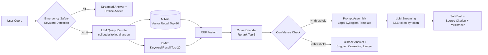

<div align="center">

# ⚖️ LexAtlas

**RAG-Powered Legal Intelligence Platform**

*Every legal answer — grounded in statutes, backed by cases, with traceable reasoning.*

[中文文档](README.md) | English


[Quick Start](#-quick-start) · [Architecture](#-architecture) · [API Docs](#-api-docs) · [Contributing](CONTRIBUTING.md)

</div>

---

> ⚠️ **Disclaimer**: LexAtlas is built for legal knowledge exploration and RAG engineering practice. Its output does **not** constitute legal advice and cannot replace a licensed attorney. Every answer cites its sources and proactively suggests consulting a professional lawyer when confidence is low.

## Why LexAtlas?

Asking a raw LLM a legal question gets you a **fluent but untrustworthy** answer — hallucinated statutes, fabricated cases, zero verifiability. LexAtlas solves this with Retrieval-Augmented Generation:

| | Raw LLM | LexAtlas |
| --- | --- | --- |
| Statute citations | ❌ High hallucination risk | ✅ Retrieved from knowledge base, cited per clause |
| Answer structure | Free-form | ✅ Legal syllogism: Fact Finding → Legal Application → Action Plan |
| Traceability | None | ✅ Full retrieval pipeline visualized (recall → fusion → rerank) |
| Boundary awareness | None | ✅ Low-confidence answers auto-trigger "consult a lawyer" fallback |

## ✨ Key Features

- **🔍 Hybrid Retrieval** — Dense vector search (Milvus) + BM25 keyword recall in parallel, fused with Reciprocal Rank Fusion (RRF): catches both semantically similar and precisely phrased provisions
- **📊 Cross-Encoder Reranking** — Fine-grained ranking that distinguishes subtle differences like "liability constituting" vs. "liability exempted"
- **⚖️ Legal Reasoning Chain** — Prompt engineering forces structured output: *Fact Finding → Legal Application → Similar Cases → Action Plan*, aligned with legal methodology
- **🛡️ Triple Safety Net** — Emergency personal-safety keywords trigger instant hotline advice (110/120) → low-confidence universal disclaimer → LLM self-evaluation of its own answer
- **⚡ Hot-Question Cache** — Redis frequency-based caching with simulated stream replay: popular questions drop from tens of seconds to milliseconds
- **🧠 Admin Hot-Tuning** — 12+ runtime parameters (vector TopK, rerank threshold, confidence gate, LLM temperature...) stored in DB, **effective immediately without restart**
- **📄 All-Format Ingestion** — PDF / Word parsing → smart chunking → embedding → upsert, with async task status tracking
- **🌊 SSE Streaming + Pipeline Visualization** — Token-by-token output while the frontend shows live progress of rewrite → retrieval → rerank stages
- **🎙️ Voice Input** — Browser recording → WebSocket real-time transcription → auto-fill
- **🔐 Enterprise Baseline** — JWT auth, RBAC, full audit logging, SpringDoc API docs, Actuator health checks

## 🏗️ Architecture

### Tech Stack

```
Presentation   Vue 3.5 · TypeScript · Element Plus · Pinia · ECharts · Markdown
Application    Spring Boot 3.2 · Spring Security · JWT · MyBatis-Plus · WebSocket
RAG Engine     Query Rewriter · Hybrid Retriever · RRF Fusion · Cross-Encoder · Safety Guard
Model Service  LLM (qwen) · Embedding (text-embedding-v3, 1024d) · Reranker (gte-rerank)
Storage        MySQL 8 · Milvus 2.3 · Redis 7 · MinIO
```

### RAG Pipeline



> All pipeline parameters (recall counts, fusion strategy, confidence threshold, temperature) are tunable live in the admin console — stored in the `sys_ai_config` table and read dynamically via `AiConfigHolder`.

### Project Structure

```
LexAtlas/
├── src/main/java/com/lexatlas/
│   ├── controller/              # REST API (SSE streaming / WebSocket speech proxy)
│   ├── service/rag/             # ⭐ RAG pipeline core
│   │   ├── RagPipeline          #    Main orchestration (with cache replay)
│   │   ├── QueryRewriter        #    Colloquial question → professional search terms
│   │   ├── VectorRetriever      #    Milvus dense recall
│   │   ├── BM25Retriever        #    BM25 keyword recall (statute/amount patterns)
│   │   ├── RRFFusion            #    Reciprocal Rank Fusion
│   │   ├── CrossEncoderReranker #    Fine-grained reranking
│   │   ├── PromptAssembler      #    Legal reasoning chain prompt assembly
│   │   ├── SafetyGuard          #    Emergency detection / confidence / self-eval
│   │   └── RagCacheService      #    Hot-question cache
│   ├── service/knowledge/       # Document parsing → chunking → embedding → upsert
│   ├── entity/ · mapper/        # MyBatis-Plus entities & data layer
│   ├── config/                  # Security / Milvus / LLM / WebSocket config
│   └── common/                  # Unified response · global exceptions · audit aspect
├── lexatlas-frontend/           # Vue 3 SPA
├── src/main/resources/
│   ├── prompts/                 # Prompt templates (QA / rewrite / safety check)
│   └── sql/lexatlas.sql         # Database bootstrap script (no fixed accounts)
├── docker-compose.yml           # One-command full-stack deployment
└── docs/                        # Sample datasets & deployment docs
```

## 🚀 Quick Start

### Docker (Recommended)

```bash
git clone https://github.com/<your-org>/LexAtlas.git
cd LexAtlas

# Configure LLM API key (Alibaba Bailian, or any OpenAI-compatible service)
cp .env.example .env
vim .env    # set API key, JWT_SECRET, ADMIN_PASSWORD, and database password

# Full stack: MySQL + Redis + MinIO + Milvus + backend + frontend
docker compose up -d
```

Once started:

| Service | URL |
| --- | --- |
| Web App | <http://localhost> |
| Backend API | <http://localhost:8080> |
| Swagger UI | <http://localhost:8080/swagger-ui.html> |
| Health Check | <http://localhost:8080/actuator/health> |
| MinIO Console | <http://localhost:9001> |
| Milvus | localhost:19530 |

### Local Development

**Prerequisites**: JDK **17** · Maven 3.9+ · Node 22.22.2+ · MySQL 8 · Redis 7 · Milvus 2.3 · MinIO

```bash
# 1. Start middleware only
docker compose up -d mysql redis minio etcd milvus

# 2. Initialize database
mysql -uroot -p < src/main/resources/sql/lexatlas.sql

# 3. Set environment variables
export BAILIAN_API_KEY=sk-xxxx
export JWT_SECRET=$(openssl rand -base64 48)
export ADMIN_USERNAME=admin
export ADMIN_PASSWORD='replace-with-a-strong-password'

# 4. Start backend (port 8080)
mvn spring-boot:run

# 5. Start frontend (port 5173, API auto-proxied)
cd lexatlas-frontend && npm install && npm run dev
```

### Initial Administrator

No fixed-password account is included. On first startup, `ADMIN_USERNAME` and `ADMIN_PASSWORD` create the administrator (minimum 12-character password). Remove both variables from the runtime environment after creation. Regular users can register from the login page.

Upload legal texts (verify their licensing) via Knowledge Base Management, then wait for ingestion to finish before using the full RAG workflow.

## ⚙️ Configuration Reference

<details>

<summary><b>Environment Variables</b> (click to expand)</summary>

| Variable | Required | Default | Description |
| --- | :-: | --- | --- |
| `BAILIAN_API_KEY` | ✅ | — | LLM / Embedding / Rerank API key |
| `JWT_SECRET` | prod✅ | dev default | JWT signing secret (≥48 chars) |
| `ADMIN_USERNAME` / `ADMIN_PASSWORD` | first run✅ | — | Creates the initial administrator; password must be at least 12 characters |
| `CORS_ALLOWED_ORIGINS` | — | localhost | Comma-separated frontend origins allowed to call the API |
| `PASSWORD_RESET_DEMO_MODE` | — | false | Logs reset codes for local demos only; never enable in production |
| `LLM_BASE_URL` | — | DashScope | Any OpenAI-compatible endpoint |
| `LLM_MODEL` | — | `qwen-plus` | Chat model |
| `MYSQL_HOST` / `MYSQL_USERNAME` / `MYSQL_PASSWORD` | — | localhost/root/root | Local database connection |
| `MYSQL_ROOT_PASSWORD` / `MYSQL_DATABASE` | Docker✅ | — / lexatlas | Docker MySQL initialization |
| `REDIS_HOST` | — | localhost | Redis |
| `MINIO_ENDPOINT` | — | <http://localhost:9000> | MinIO |
| `MILVUS_HOST` / `MILVUS_PORT` | — | 127.0.0.1/19530 | Milvus |

</details>

<details>

<summary><b>Live-Tunable RAG Parameters</b> (Admin Console · AI Config Center)</summary>

| Parameter | Default | Description |
| --- | --- | --- |
| `rag.vector_top_k` | 20 | Vector recall count |
| `rag.bm25_top_k` | 20 | BM25 recall count |
| `rag.rrf_top_n` | 20 | RRF fusion retention |
| `rag.rerank_top_k` | 5 | Final reranked count |
| `safety.confidence_threshold` | 0.3 | Below this triggers fallback |
| `cache.freq_threshold` | 3 | Cache after N identical questions |
| `llm.chat_temperature` | 0.3 | Rewrite / self-eval temperature |
| `llm.streaming_temperature` | 0.7 | Generation temperature |
| `llm.timeout_seconds` | 60 | LLM timeout |

</details>

## 📡 API Docs

Start the backend and open Swagger UI (`/swagger-ui.html`) for the full interactive reference. Core endpoints:

| Module | Endpoint | Description |
| --- | --- | --- |
| Auth | `POST /api/user/login` · `POST /api/user/register` | JWT login / register |
| Chat | `GET /api/chat/stream` (SSE) | Streaming QA; event flow: `rewrite → retrieval → rerank → token → done` |
| Conversations | `GET /api/chat/conversations` | Conversation history |
| Knowledge | `POST /api/knowledge/upload` | Document upload & async ingestion |
| Admin Config | `PUT /api/admin/ai-config/batch` | Hot-update RAG parameters |
| Speech | `WS /api/speech/ws` | Real-time speech transcription proxy |
| Ops | `GET /actuator/health` | Health check |

## 🗺️ Roadmap

- [ ] Multi-knowledge-base partitioning with permission isolation (per legal domain / tenant)
- [ ] Structured frontend rendering of the legal reasoning chain
- [ ] Auto-aligned statute citation popovers in answers
- [ ] Retrieval quality evaluation loop based on `law_feedback` data
- [ ] Testcontainers integration tests
- [ ] i18n English UI

## 🤝 Contributing

All forms of contribution are welcome! Please read [CONTRIBUTING.md](CONTRIBUTING.md) first (code style, commit conventions, self-check list). Report security vulnerabilities privately via [SECURITY.md](SECURITY.md).

## 📄 License

Licensed under the [MIT License](LICENSE).

## ⚖️ Legal & Compliance

- Output of this project **does not constitute legal advice**; consult a licensed attorney for important matters
- Comply with local laws when using this project; ensure you have the rights to uploaded knowledge-base documents
- Do not use this project for any unlawful purposes
- All sample data is fictional or derived from public court records; any resemblance is coincidental

---

<div align="center">

**LexAtlas** · Retrieval-Augmented Legal Intelligence · Built with ❤️ and RAG

</div>
