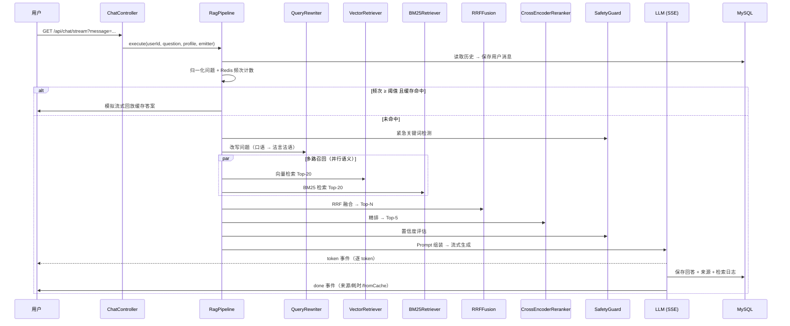

# LexAtlas 架构设计

> 本文面向贡献者与技术研究者，深入解释 RAG 流水线每一环的设计决策。阅读本文前建议先过一遍 [README](../README.md) 的架构总览。

## 目录

- [整体数据流](#整体数据流)
- [阶段详解与设计决策](#阶段详解与设计决策)
  - [1. 查询改写（Query Rewriter）](#1-查询改写query-rewriter)
  - [2. 多路召回（Hybrid Retrieval）](#2-多路召回hybrid-retrieval)
  - [3. RRF 融合（Reciprocal Rank Fusion）](#3-rrf-融合reciprocal-rank-fusion)
  - [4. Cross-Encoder 重排序](#4-cross-encoder-重排序)
  - [5. Prompt 组装与法律推理链](#5-prompt-组装与法律推理链)
  - [6. 流式生成与缓存](#6-流式生成与缓存)
  - [7. 安全兜底（Safety Guard）](#7-安全兜底safety-guard)
- [关键设计取舍](#关键设计取舍)
- [如何扩展：新增一路召回](#如何扩展新增一路召回)
- [性能画像](#性能画像)

---

## 整体数据流

## 阶段详解与设计决策

### 1. 查询改写（Query Rewriter）

**问题**：用户的口语化表述与法条原文之间存在巨大的词汇鸿沟——"被炒鱿鱼"vs"劳动合同解除"、"离婚分房子"vs"离婚财产分割"。

**方案**：用 LLM 做一次轻量改写（`prompts/query_rewrite.txt`），保留核心意图的同时替换为标准法律术语。

**决策依据**：
- 改写发生在**检索前**而非生成前——改写收益全部体现在召回率上
- 温度设为 0.3（`llm.chat_temperature`），保证改写稳定性
- 前端通过 SSE `rewrite` 事件展示改写前后对比，**让用户看到系统"听懂了什么"**——这是可解释性的一部分

### 2. 多路召回（Hybrid Retrieval）

单路检索各有盲区：

| 召回方式 | 擅长 | 失效场景 |
|----------|------|----------|
| 向量语义（Milvus） | 同义改写、跨表述匹配 | 精确编号/条款号匹配弱 |
| BM25 关键词 | 法条编号、专有名词、金额 | 同义表述召回弱 |

法律场景的特殊性：用户经常**精确引用**"第四十八条"，也经常**口语描述**"被公司白嫖了"。所以两路都必须有。

`BM25Retriever` 中内置了法律语料的正则增强（`第\d+条`、金额模式），在分词阶段显式提取这类 token，避免被通用停用词逻辑误伤。

### 3. RRF 融合（Reciprocal Rank Fusion）

**为什么是 RRF 而不是加权求和？**

加权求和（`score = α·vector + β·bm25`）有一个致命问题：两路的分数量纲完全不同。向量余弦分数在 0-1 附近密集分布，BM25 分数则可以到两位数——调 α/β 变成玄学。

RRF 只用**排名**：`score(d) = Σ 1/(k + rank(d))`，天然无量纲，对任意检索器的分数分布都鲁棒。k=60 是业界经验值（源自 [Cormack et al. 2009](https://plg.uwaterloo.ca/~gvcormac/cormack_sigir09.pdf)），本系统将其暴露为可调参数 `rag.rrf_k_constant`。

**去重策略**：以内容前 50 字符为指纹 key（`RRFFusion.java`）。同一文档在两路都被召回时，RRF 分数叠加并标记 `HYBRID` 来源——双路命中的文档天然获得排名优势，这符合直觉：多路证据一致的结果更可信。

### 4. Cross-Encoder 重排序

**为什么需要第二阶段排序？**

Bi-Encoder（向量检索）为了性能，把 query 和 doc **独立编码**，交互信息丢失。Cross-Encoder 把 (query, doc) 拼接后联合编码，能捕捉细粒度语义交互，但计算成本是 O(候选数 × 交互编码)——所以只能对融合后的 Top-20 精排，取 Top-5。

**法律场景的价值**：这一步能区分"赔偿责任**构成**"与"赔偿**免除**"这类对法律后果截然相反、但字面高度相似的条款。

工程实现上，重排序调用云 API（`gte-rerank`）而非本地模型，是出于部署门槛的取舍（见[关键设计取舍](#关键设计取舍)）。

### 5. Prompt 组装与法律推理链

`PromptAssembler` 按 `prompts/legal_qa.txt` 模板组装，注入四个上下文块：**用户法律档案**（region/identity/legalType）、**检索文献**（Top-5 切片含来源标注）、**对话历史**（最近 3 轮）、**用户问题**。

**法律三段论是本项目的核心创新点**：Prompt 强制 LLM 按「事实认定 → 法律适用 → 类案参考 → 行动建议 + 免责声明」结构输出。这不仅是格式美化——它对齐了法学方法论（大前提-小前提-结论），**迫使模型显式暴露推理链条**，幻觉更容易被用户识别。

### 6. 流式生成与缓存

**SSE 而非 WebSocket**：问答是单向服务端推送场景，SSE 更简单、自动重连、过 HTTP/2 友好。WebSocket 仅用于语音上传（双向、二进制）。

**缓存策略**（`RagCacheService`）：
1. 每次提问对归一化问题在 Redis ZSet 中计数
2. 频次 ≥ `cache.freq_threshold`（默认 3）时，答案写入 Hash（TTL 可配）
3. 命中后**按 30 字符/批模拟流式回放**——保持前端体验一致，同时省掉全量 RAG 开销

**为什么阈值触发而不是全量缓存**：法律问答长尾极长，全量缓存命中率低且引发 Redis 膨胀；只缓存"群众真实关心的高频问题"，投入产出比最高。

### 7. 安全兜底（Safety Guard）

三层防线，按成本递增排列：

1. **关键词检测**（零成本）：紧急人身安全词表命中 → 追加报警提示（110/120）。词表在 `SafetyGuard` 中常量化，覆盖家暴/非法拘禁/性侵等场景
2. **置信度评估**（零成本）：重排 Top-5 的最高分线性映射到 [0,1]，低于 `safety.confidence_threshold` → 回答追加"基于通用法律知识，建议咨询律师"声明
3. **LLM 答案自评**（一次 LLM 调用）：按 `prompts/safety_check.txt` 让模型自评答案安全性，返回 JSON 结构化结果

> 单元测试覆盖了前两层的边界条件（空输入、null、分数回退），见 `SafetyGuardTest`。

## 关键设计取舍

| 决策 | 替代方案 | 选择理由 |
|------|----------|----------|
| 云 API 重排序（gte-rerank） | 本地 BGE-reranker 推理服务 | 部署门槛：本地模型需 GPU/大内存，云 API 让开箱体验门槛降到"一个 API Key" |
| MySQL 存切片元数据 + Milvus 存向量 | 全部塞 Milvus scalar 字段 | 关系数据（文档管理/分页/审计）本就该用关系库；Milvus 只做它擅长的事 |
| 内容前 50 字做 RRF 去重 key | 切片 ID | 同一文档可能被不同来源、不同批次导入，ID 不稳定；内容指纹语义上更接近"同一证据" |
| 参数存 DB 热加载 | application.yml + 重启 | RAG 调参是高频迭代行为，重启 30 秒 × 每天 20 次 = 灾难 |
| `Executors.newCachedThreadPool` 驱动 SSE | WebFlux/虚拟线程 | 保持技术栈简单（Servlet + SSE）；生产高并发场景建议换虚拟线程（JDK 21+）或反应栈 |

## 如何扩展：新增一路召回

以"添加一个基于 Milvus scalar 过滤的**法条年代过滤检索**"为例：

1. 在 `service/rag/` 新建 `EraRetriever`，实现与 `VectorRetriever` 相同的签名：`List<RetrievedChunk> retrieve(String query, String category, int topK)`
2. 在 `RagPipeline` 中注入并调用，将结果与现有两路一起交给 `RRFFusion`——**RRF 天然支持 N 路融合**，`fuse()` 改为接收 `List<List<RetrievedChunk>>`（当前代码是显式两路，重构点已隔离在这一处）
3. 若新检索器有独立参数，在 `sys_ai_config` 表加一行配置即可在管理后台热调
4. 补充对应单元测试（参考 `RRFFusionTest` 的构造方式）

## 性能画像

以"公司拖欠工资怎么办"这类典型问题为参考（qwen-plus + 云 rerank，数值为量级参考而非承诺）：

| 阶段 | 耗时量级 | 占比 |
|------|---------|------|
| Query 改写（LLM） | 0.5-1.5s | ~20% |
| 双路召回（并行） | 50-200ms | ~5% |
| RRF 融合 | <5ms | ~0% |
| Cross-Encoder 精排（云 API） | 0.3-1s | ~15% |
| LLM 流式生成 | 3-10s | **~60%** |
| **缓存命中时** | **<100ms（感知）** | — |

优化方向优先级：缓存命中率 > 改写延迟（可换小模型）> 精排延迟。
